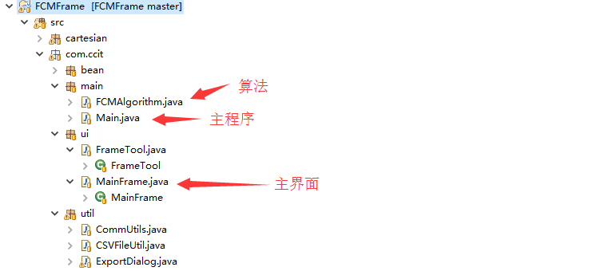
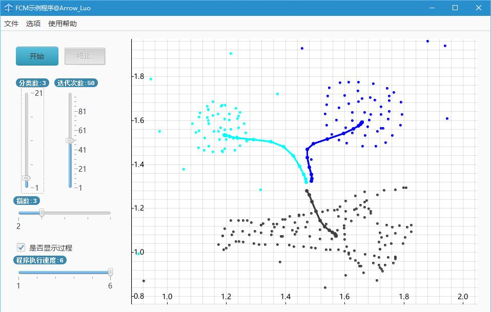

# FCM
Fuzzy c-means (FCM) is a method of clustering which allows one piece of data to belong to two or more clusters.

This is a java application with visual interface.

** If you are lazy :), you can download zip to see FCMFrame_deploy, there are .exe waiting for you **

** FCMFrame_deploy 有可执行exe哦~ **

The function of this application just like "fcm demo" in matlab.

